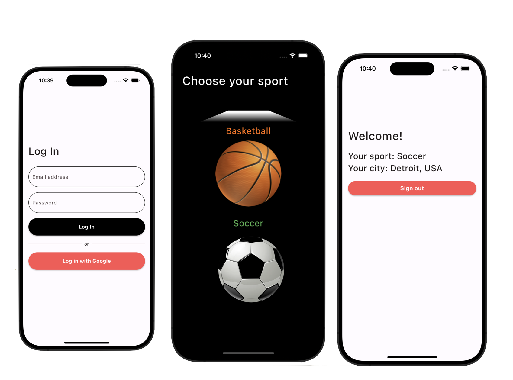

# Just Play

# About this project

This project is a test for Just Play.

this version use `null safety` and `getx` as state management.

`firebase authentication` and `google sign in` were used for the login.

this version contains some native animations with `Tweens`

## how to run the project.

```shell
flutter pub get
flutter run
```

<p align="center">
  
</p>
